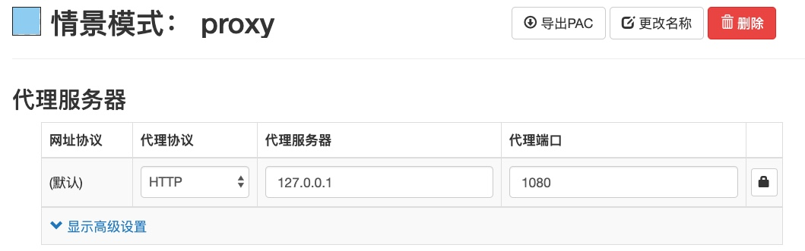
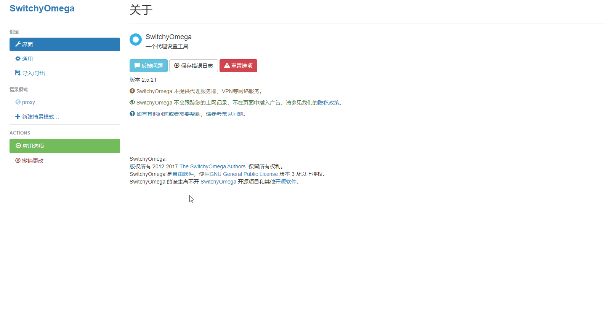

= SwitchyOmega-Whitelist

这是一个 SwicthyOmega 的白名单仓库。

== 工作模式

代理工具常见的使用模式是黑名单，即匹配后走代理，不匹配默认直连。白名单则相反，匹配直连，不在列表中默认走代理。

== 这么做的好处

无论是白名单模式还是黑名单模式都是需要长时间维护的，但白名单相对较少，相对于国外网站来说国内总数要少一些。同时假定你的远端服务器拥有比较好的线路 (CN2 GIA 等)，那么默认白名单可以避开拥堵的骨干网。

== 这些域名的来源？

最初来自 link:https://github.com/v2ray/domain-list-community[domain-list-community]，现在手动更新，域名来源于日常的访问。验证方式为 https://ipip.net 提供的 ip 地理位置。

== 如何使用

link:https://chrome.google.com/webstore/detail/proxy-switchyomega/padekgcemlokbadohgkifijomclgjgif[安装 SwicthyOmega] 并配置 proxy 模式

[NOTE]
====
规则文件中写死了代理情景模式的名字，即 **proxy**。如果你需要自己改代理服务器情景模式的名字的话，导入列表后记得及时修改最后一行。
====

SwitchyOmega 插件支持 Chrome 和 Firefox。

将默认的 auto switch 模式下的默认情景模式选择 proxy，也就是白名单的工作模式。如果场景列表里没有 auto switch 模式，可以手动添加一个。

在规则列表设置添加此仓库的清单文件：https://raw.githubusercontent.com/EpLiar/SwitchyOmega-Whitelist/master/OmegaRules_auto_switch.sorl

或是点击编辑源代码，复制仓库的列表 `OmegaRules_auto_switch.sorl` 里的内容后粘贴。

== Contribute

目前这个 White list 由我本人在维护。如果你想参与，欢迎提交 pull requests，格式可以参考已有代码。
